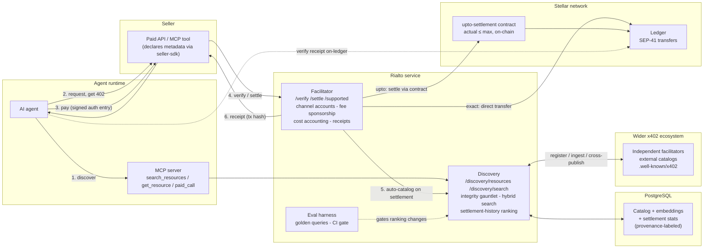

# Rialto Architecture

Status: draft for team review (branch `architecture`).
Everything in this document is grounded in one of: the x402 specs as merged upstream, the
`@x402/stellar` package as published (v2.21.0), SDF's reference implementation, our own
settled testnet runs, or an accepted design decision in `docs/decisions/`. The contract
research spike has landed ([spec draft](https://gist.github.com/Iam0TI/1bab9ffc1c0e619ba762116f2af9141c));
§3.3 reflects its design plus the two fixes proposed in review.

---

## 1. Plain-English overview

Rialto is a payment processor and a search engine glued together, for machines.

A seller with a paid API points it at Rialto and never touches blockchain plumbing. A
buyer - almost always an AI agent - asks Rialto's catalog "what services exist that do
X?", gets back results it can trust (each one carries exact payment terms and a track
record of real settlements), pays through the same service, and holds a receipt it can
verify against the public ledger. Every payment that flows through Rialto automatically
keeps the catalog fresh: getting paid is what gets a service listed.

The stack is deliberately boring: one TypeScript service (the facilitator, which also
serves discovery), one PostgreSQL database (catalog + search), one small Soroban contract
(only for capped "pay up to" payments), and an MCP server so agents can drive the whole
loop from inside their own runtime. Settlement logic is not ours - we compose the
Apache-2.0 `@x402/stellar` package that already settles payments on both Stellar networks.

## 2. The two loops

### 2.1 Payment loop (exact scheme - runs today, we verified it end to end)

```
agent                    seller API                Rialto facilitator          Stellar
  |--- GET /resource --------->|                          |                       |
  |<-- 402 + requirements -----|                          |                       |
  |  sign Soroban auth entry   |                          |                       |
  |--- retry + payment ------->|--- POST /verify -------->|-- simulate ---------->|
  |                            |<-- isValid --------------|                       |
  |                            |   (serve the resource)   |                       |
  |                            |--- POST /settle -------->|-- submit tx --------->|
  |<-- 200 + resource ---------|<-- tx hash + receipt ----|<-- settled ~5s -------|
```

Key properties, all from the merged `scheme_exact_stellar` spec and observed in our runs:

- The buyer signs an **authorization entry** (permission for one specific token transfer
  with exact arguments), not a transaction. The facilitator builds the transaction around
  it, sources it from its own account, and pays the fee - so the buyer holds zero XLM
  and the facilitator advertises `extra: {areFeesSponsored: true}` in `/supported`.
- Verification simulates against the chain before anything moves; settlement re-runs
  verification so there is no verified-then-swapped window.
- Tampering (amount, asset, recipient) is a signature failure, not a policy check - the
  facilitator cannot alter what was signed.
- Expiry is ledger-bound (`signatureExpirationLedger`); replay is impossible because the
  auth entry's protocol-level nonce is consumed on use.
- Every rejection carries a machine-readable code and a specific, non-null reason.
  (We hit the counter-example in the wild: the reference facilitator reports an RPC
  outage as `unexpected_verify_error`. Rialto's error taxonomy distinguishes
  payload-invalid / expired / simulation-failed / upstream-unreachable, because an agent
  retrying blind on an ambiguous error burns money and time.)

### 2.2 Discovery loop (the new capability)

```
seller API                    agent                 Rialto facilitator         catalog (Postgres)
  | 402 includes bazaar         |                        |                          |
  | metadata + JSON schema ---->|                        |                          |
  |                             |-- payment echoes ----->|                          |
  |                             |   the metadata         |-- validate:              |
  |                             |                        |   schema, route template,|
  |                             |                        |   soft-drop fields ----->|-- indexed
  |                             |<-- EXTENSION-RESPONSES |                          |
  |                             |    (catalog outcome)   |                          |
```

- Sellers declare metadata (name, description, tags, per-parameter descriptions, input/
  output schemas) in the 402 response; the client echoes it inside the payment payload;
  the facilitator catalogs it as a side effect of settlement. **No registration step.**
  Manual registration exists but is secondary, exactly as the Bazaar spec orders it.
- Both HTTP endpoints and **MCP tools** are cataloged; MCP entries are keyed on the
  tuple (resource URL, tool name) because one MCP endpoint multiplexes many tools.
- Cataloging outcomes are reported to the client in the `EXTENSION-RESPONSES` header
  (`success` / `processing` / `rejected` + reason), per spec.

## 3. Components

### 3.1 `packages/facilitator` - the service

Canonical x402 endpoints (`/verify`, `/settle`, `/supported`) for `stellar:testnet` and
`stellar:pubnet`, plus the discovery endpoints (§3.2 serves them, this process hosts
them). Composes `@x402/stellar`'s facilitator module for exact-scheme verify/settle
(verified present and network-complete in v2.21.0: CAIP-2 ids, network passphrases,
Horizon URLs, and USDC contract addresses for both networks).

What we add around the library:

- **Throughput**: channel accounts + a dedicated fee-bump signer, adopting the pattern
  SDF's reference facilitator documents (N channel accounts = N parallel settlements;
  accounts created with sponsored reserves; round-robin selection). Config-driven; falls
  back to single-signer for small self-hosted deployments.
- **Sponsor-cost protection**: sponsored fees mean every failed settlement costs the
  operator real XLM, so protection is economic, not arbitrary: per-principal cost
  accounting (what each caller has burned in sponsored fees), rate limits that tighten
  as a caller's settlement success rate drops, and a prepaid tier for heavy callers held
  strictly as **off-chain account credit** - never an on-chain escrow. Thresholds ship
  as configuration with defaults set from measured testnet failure data, not invented
  numbers.
- **Receipts**: the settle response already carries the transaction hash; Rialto returns
  it inside a structured receipt (network, ledger, hash, amount, asset, payTo) that an
  agent can verify against any Horizon/RPC endpoint independently of us, and retain as
  proof of payment.
- **Fee bounds**: settlement fees derive from fresh simulation with a configurable
  circuit-breaker cap (the library default is 50,000 stroops; SDF's own reference
  configuration warns that Soroban resource fees can exceed it - so the bound is
  explicit, documented configuration rather than a hardwired constant).

### 3.2 `packages/discovery` - catalog, search, federation

**Catalog (PostgreSQL).** One database holds resources, their payment options, their
metadata, embeddings, and settlement statistics. Every entry records **provenance**:
`observed-settlement` (indexed because a payment settled here), `registered` (seller
self-registered), or `ingested` (imported from an external catalog). Provenance is
visible in API responses and feeds ranking - an agent can always tell how an entry got
into the index.

**Integrity gauntlet** (the catalog-poisoning boundary, §4.2) - applied to every
submission regardless of provenance, implementing the Bazaar spec's rules:

- metadata validated against the seller-supplied JSON Schema; external `$ref`/`$id`
  resolution refused (same-document fragments only)
- `routeTemplate` sanitized: must match the spec's character set, no `..`, no `://`,
  **percent-decoded before** traversal checks; invalid templates are discarded and the
  concrete URL path used instead
- field-level soft-drop: an oversized `serviceName`, an invalid tag, a loopback/IP-literal
  `iconUrl` each drop that field alone; only an invalid envelope rejects the entry
- outcomes reported via `EXTENSION-RESPONSES`

**Search** (accepted design - ADR 0002): hybrid retrieval - true BM25 (not bare
`tsvector` ranking) + a local, permissively-licensed embedding model run in-process -
fused with reciprocal rank fusion; query-derived structured constraints (a network named
in the query is a hard filter, asset/price mentions boost); synthetic agent-intent
queries generated per resource at index time and embedded alongside the metadata;
**settlement-history ranking** so a proven endpoint (recent, successful, real
settlements) outranks an untested listing. No Stellar catalog surfaces settlement history
today; facilitator integration makes it cheap and real-time rather than requiring a
separate chain-indexing pipeline. Wire surface is exactly the spec's:
`/discovery/resources` with `type`/`payTo`/`scheme`/`network`/`extensions`/`limit`/`offset`,
`/discovery/search` with `query`, cursor pagination, and honest `partialResults`.

**Federation** - the answer to the open interop question (stellar/x402-stellar#50: the
registration path for independent facilitators is undetermined):

- a registration endpoint where any independent facilitator lists itself and its catalog
  feed
- scheduled ingestion of external catalogs (CDP-shaped discovery APIs and
  `/.well-known/x402` self-descriptions), entries marked `ingested` and passed through
  the same integrity gauntlet
- cross-publishing: Rialto's own catalog is exportable in the same shapes it ingests, so
  other indexes can carry Stellar services without asking us

A service settles anywhere but is findable everywhere. Stellar must not be a walled
garden; neither will Rialto be one.

### 3.3 `contracts/upto-settlement` - the capped-payment contract

**Design accepted (ADR 0001); mechanics finalized by the contract research spike**
([spec draft](https://gist.github.com/Iam0TI/1bab9ffc1c0e619ba762116f2af9141c), with two
fixes proposed in review). The cap is enforced on-chain by a minimal, stateless Soroban
contract (`UptoSettlement`): the client signs
**(recipient, asset, max amount, validAfter, deadline, salt, autoRevoke)** in one auth
entry - the actual amount is deliberately excluded from the signature and arrives
unsigned at settlement. Inside a single atomic `settle()` call the contract grants
itself an allowance for the maximum (satisfied by a pre-signed fixed-argument
sub-invocation), transfers the actual amount, and - if the client opted in via
`autoRevoke` - zeroes any leftover allowance in the same transaction, so no allowance
ever exists on-chain outside the settlement itself. `actual ≤ max` is checked by the
contract; both time bounds are enforced on-chain (`validAfter`/`deadline` as clock time
against the ledger timestamp); replay protection rides Soroban's native auth-entry
nonce; zero usage means no transaction at all.

Two review fixes pending in the spec draft: the allowance's expiry value must be
client-chosen and signed (a contract-computed value cannot match the pre-signed
sub-invocation's exact arguments), and `salt` becomes required.

Settlement is deliberately **facilitator-agnostic**: no facilitator identity is bound
into the signature, so any facilitator holding the signed entries can submit - which is
what the federation model and the self-facilitation path need. The tradeoff is stated
honestly: a leaked authorization can at worst settle the signed maximum to the signed
recipient - never a different amount ceiling, never a different recipient.

### 3.4 `packages/mcp-server` - the agent interface

Three tools wrapping the full loop with deterministic, structured IO:

- `search_resources` - natural-language query + structured filters over the catalog
- `get_resource` - full metadata, schemas, payment requirements, provenance, settlement
  stats for one resource
- `paid_call` - executes discover → pay → retry end to end and returns the result plus
  the verifiable receipt

Machine-readable error codes; a non-null reason on every rejection; versioned schemas.

### 3.5 `packages/seller-sdk`

Declaration helpers (typed metadata builders including per-parameter descriptions) plus
**local validation that mirrors the facilitator's integrity gauntlet exactly** - a seller
finds out about a malformed asset id or an invalid route template on their laptop, not in
production. Malformed listings are an observed real-world problem, not hypothetical: a
production catalog today carries Stellar entries whose asset identifiers no conformant
client can settle.

### 3.6 `packages/eval-harness`

Public, versioned search-quality evaluation: 100-200 golden queries with graded
judgments (pooled from all rankers, documented rubric, LLM-assisted labeling with a
human-audited sample, judge model ≠ generation model), scored on nDCG@10 / MRR /
Recall@20 in CI - a ranking change ships only if it does not significantly regress
against a held-out split. The same pipeline that generates synthetic per-resource queries
feeds the judgment set. Anyone can re-run our numbers.

## 4. Trust boundaries - who could cheat, and what stops them

| # | Boundary | Attacker | Defense |
|---|----------|----------|---------|
| 4.1 | Client signature | A facilitator (including us) altering amount, asset, or recipient | The signed auth entry binds exact arguments; any change is a signature failure enforced by Stellar consensus. Non-custodial by construction. |
| 4.2 | Catalog integrity | A hostile client echoing forged metadata or a crafted route template into the payment payload | The integrity gauntlet (§3.2): schema validation, sanitized route templates (percent-decode before traversal checks), field-level soft-drop, no external `$ref`, provenance labeling. Quality judgment (is the service good?) stays with agents - integrity validation (is the entry forged?) is ours. |
| 4.3 | Spending cap | A seller or facilitator settling above an agent's authorized maximum, redirecting funds, or settling twice | The `upto` contract: cap and recipient are in the signed arguments, `actual ≤ max` checked on-chain, auth-entry nonce consumed on settlement. Settlement is facilitator-agnostic by design - the signature bounds *what* can happen, not *who* submits it. |
| 4.4 | Sponsor economics | Callers burning the operator's sponsored fees with settlements that fail | Per-principal cost accounting; rate limits tied to settlement success rate; prepaid tier as off-chain credit. Failed-settlement cost is bounded and attributable. |

## 5. Behavior under failure

- **Semantic search arm down** (embedding process unavailable): serve lexical-only
  results with `partialResults: true` - the spec's field, used honestly.
- **Catalog database down**: `/discovery/*` degrades; `/verify` and `/settle` are
  unaffected - payments never depend on the index.
- **Soroban RPC unreachable or flaky**: bounded retries, then a rejection whose code
  names the upstream failure (not a generic verify error) - an agent can distinguish
  "my payment is bad" from "try again later".
- **Channel account exhaustion** (burst beyond N parallel settlements): requests queue
  with backpressure rather than colliding on sequence numbers.
- **Testnet reset**: facilitator accounts are re-fundable by script (documented SDF
  pattern); the catalog is unaffected.

Availability target for hosted endpoints is 99%+, with the degraded modes above as the
explicit story for the gap.

## 6. Deferred scope - and where it would attach

Stated deferrals, per the RFP's own guidance, with the attachment points left open:

- **On-chain Soroban registry** (optional/stretch in the RFP): the federation layer
  (§3.2) is the attachment point - a future job could mirror catalog roots on-chain.
  Deferred for rent/TTL overhead; nothing in the schema forecloses it.
- **Batch settlement** (RFP phase two): would land as a new entrypoint on the settlement
  contract (§3.3) plus a scheme handler in the facilitator. The prepaid tier deliberately
  stays off-chain credit so it does not pre-empt this design.
- **Auth-capture** (RFP phase two): a scheme-handler slot in the facilitator; the
  verify/settle separation already models authorize-then-capture timing.

## 7. Diagram



Trust boundaries in the picture: the signature boundary sits on edge 3→4 (nothing past
the seller can alter what the agent signed); the poisoning boundary sits on edge 5 (the
gauntlet between facilitator and catalog); the cap boundary is the contract node; the
sponsor boundary lives inside the facilitator (cost accounting before submission).

---

*Review notes for the team: §3.3 finalizes after the contract spike lands Monday; every
other section is complete. Sources: x402 specs (`scheme_exact_stellar`, `scheme_upto`,
`extensions/bazaar`), `@x402/stellar` v2.21.0, stellar/x402-stellar reference patterns,
ADRs 0001-0002, and our settled testnet runs.*
