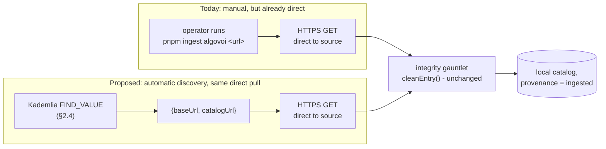

# Federation peer discovery: a minimal Kademlia DHT, not a relay network

**Status: design proposal, not implemented.** No DHT client exists in this repo. This
document works out the mechanism in enough depth to build from later; it is not a
description of running code. See [ADR 0003](../decisions/0003-federation-dht-discovery.md)
for the decision record this expands on, and `docs/architecture.md` §3.2 /
`docs/threat-model.md` §6 for how it relates to what *is* built today (`/federation/register`,
`/federation/peers`, `ingest-cli.ts`).

## 1. The problem, precisely

Today, a facilitator is only findable by Rialto if it already knows Rialto exists and
calls `POST /federation/register`, or if a Rialto operator already knows about it and
manually runs `pnpm ingest algovoi <url>`. Both directions require the two parties to
already be aware of each other by some out-of-band means. That's fine between two
specific operators who've talked to each other; it doesn't answer "how does a brand
new, independent facilitator become findable by the wider x402 ecosystem without
individually introducing itself to every index that might carry it."

That's a lookup problem with a specific shape: *given a key, find who holds the value
for it, without asking a central party*. That shape has a well-known solution.

## 2. Kademlia from first principles

Kademlia (Maymounkov & Mazières, 2002) is a distributed hash table: a way for a
network of nodes to collectively store and look up key→value pairs with no
coordinator, where every node knows a little about the network and any node can find
any key in a small, bounded number of hops.

### 2.1 Node IDs and the XOR distance metric

Every node picks (or derives) an ID in the same address space as the keys it will
store - conventionally a 160-bit or 256-bit number, matching the output width of the
hash function used to derive keys. **Distance** between any two IDs `a` and `b` is
defined as:

```
d(a, b) = a XOR b        (interpreted as an unsigned integer)
```

This is a strange-looking metric until you check that it actually behaves like a
distance:

- **Identity**: `d(a, a) = a XOR a = 0`. A node is distance 0 from itself, and nothing
  else is.
- **Symmetry**: `a XOR b = b XOR a`, always. Distance from A to B equals distance from
  B to A.
- **Triangle inequality**: `d(a, c) <= d(a, b) XOR-plus d(b, c)` holds because XOR
  distance is a valid ultrametric - every triangle is isosceles with the two longer
  sides equal, which is what makes routing "always get closer" a well-defined,
  terminating process rather than something that can loop.

The property that actually matters for routing: XOR distance is **unidirectional** -
for any node `a` and any distance `d`, there is exactly one node `b` with `d(a,b) =
d`. That means every node's view of "who is near me" is consistent no matter who's
asking, which is what lets independently-run routing tables converge on the same
answer without comparing notes.

### 2.2 k-buckets: why the routing table is small

A node does not track the whole network. It keeps, for each bit-length prefix `i` of
its own ID, up to `k` contacts whose distance falls in `[2^i, 2^(i+1))` - a
**k-bucket**. With a 160-bit ID space, that's up to 160 buckets, each holding at most
`k` contacts (Kademlia's original paper uses `k=20`; BitTorrent's Mainline DHT uses
8).

The shape this produces: a node knows a lot about the region of ID-space near its own
ID (many buckets are populated, because the address space near it is "wide" in prefix
terms), and only a handful of contacts for each of the far, wide swaths of the rest of
the network. That asymmetry is exactly right for lookups - you need fine-grained
knowledge of your neighborhood and only need to know *a* signpost pointing toward
anywhere else, because that signpost's routing table has fine-grained knowledge of
*its* neighborhood, one hop closer to any target.

Total routing table size: `O(k log n)` contacts for a network of `n` nodes - bounded
and small (a few hundred entries) even for a network with millions of participants.

### 2.3 The four RPCs

- **PING** - is this node still alive.
- **STORE** - here is a key/value pair, please keep it.
- **FIND_NODE** - given a target ID, return the `k` contacts *you* know that are
  closest to it.
- **FIND_VALUE** - like FIND_NODE, but if the responding node itself holds the value
  for that exact key, return the value instead of contacts.

Everything else in the protocol - joining, looking up a key, republishing - is built
out of these four.

### 2.4 Iterative lookup: how a query actually narrows

To find the value for key `K`, a node:

1. Picks the `α` closest contacts to `K` from its own routing table (`α` is a small
   concurrency parameter, typically 3).
2. Sends FIND_VALUE(K) to each in parallel.
3. Each response either returns the value (done), or returns contacts closer to `K`
   than any queried so far.
4. Merges newly-learned contacts into the candidate set, repeats step 2 against the
   `α` closest **not yet queried**, until a round produces no contact closer than the
   best one already found.

Because each bucket handoff crosses into a region of ID-space roughly half the
remaining distance to the target, this converges in `O(log n)` hops - a network of a
million nodes resolves in roughly 20 hops, the same logic that makes BitTorrent DHT
lookups and IPFS content routing fast at their actual internet-wide scale.

### 2.5 Worked example (small, for intuition)

4-bit ID space (real deployments use 160+ bits; a toy space makes the arithmetic
checkable by hand). Target key `K = 1001`. Node `N = 0111` is looking it up and knows
these four contacts:

| contact | ID | `d(K, contact) = K XOR contact` | decimal |
|---|---|---|---|
| A | `1000` | `0001` | 1 |
| B | `0110` | `1111` | 15 |
| C | `1011` | `0010` | 2 |
| D | `0001` | `1000` | 8 |

Closest-first order: **A (1)**, **C (2)**, D (8), B (15). `N` queries A and C first
(assuming `α=2`). If A happens to hold `K`'s value directly, the lookup ends there -
one hop, because A's ID and K differ in only the lowest bit. If neither has it, A and
C each return *their* closest-known contacts to `1001`, which - because A and C are
already near the target - are likely to include a node distance 0 or 1 from `K`,
closing the gap almost entirely in the second round. This is the mechanism, not the
scale - real lookups look identical, just with more bits and more rounds.

## 3. How BitTorrent and IPFS use this same primitive

Both systems reuse Kademlia for exactly the "find who holds this" step, and both draw
the same line Rialto's proposal draws: **the DHT stores pointers, never the payload**.

- **BitTorrent Mainline DHT (BEP 5)** - trackerless torrents. Key = the torrent's
  infohash. Value = the swarm - a list of peer IP:port pairs currently seeding or
  leeching that torrent. A client looks up the infohash, gets back peers, then
  downloads the actual file data over a **direct** peer-to-peer connection to one of
  them - never through the DHT.
- **IPFS content routing (libp2p-kad-dht)** - key = a content identifier (a hash of
  the data). Value = a *provider record*, essentially "peer X claims to have a block
  matching this CID." A client resolves the CID to a provider, then fetches the
  actual block data over a **direct** connection (via libp2p's transport layer) to
  that provider - again, never through the DHT.

Rialto's proposal is the same shape one level up: key = a facilitator's node ID.
Value = `{baseUrl, catalogUrl}` - a pointer, not the catalog. The catalog itself is
always fetched with a direct HTTPS request to the facilitator the pointer names.

## 4. Rialto's planned DHT record

```
key   = facilitator node ID   (derivation: open, see ADR 0003 §"What's not decided yet")
value = {
  baseUrl:    string   # e.g. https://facilitator.example.com
  catalogUrl: string   # the discovery feed this facilitator exposes for pulling
  # possibly a public key, if record-signing is adopted later (also open)
}
```

**Joining**: a new facilitator contacts a small, well-known set of bootstrap nodes,
performs an iterative FIND_NODE lookup for its own ID (the standard Kademlia join
procedure - this simultaneously populates its own routing table and announces its
presence to the nodes along the path), then STOREs its own record.

**Discovering one specific peer** (if its node ID is already known - e.g. from an
out-of-band introduction) is a plain FIND_VALUE lookup, §2.4.

**Discovering peers you don't already have an ID for** is a different problem than
what vanilla Kademlia solves - Kademlia is built to answer "where is this specific
key," not "list everyone in the network." BitTorrent and IPFS both lean on a secondary
convention for this shape of query (well-known/rendezvous keys, or crawling); Rialto's
design would need the same kind of secondary mechanism for "discover facilitators I
don't already know an ID for" rather than expecting the base protocol to provide it -
named here as an open design gap, not solved by this document.

## 5. Why not full libp2p

| | libp2p | Rialto's proposed scope |
|---|---|---|
| Transport negotiation | Multiple transports (TCP, QUIC, WebSocket, WebRTC), negotiated per-connection | One: HTTPS. Every facilitator already runs an HTTPS server. |
| Stream multiplexing | Yes (mplex/yamux) | Not needed - no long-lived multiplexed streams, just discrete request/response |
| NAT traversal / circuit relay | Yes - AutoNAT, hole punching, relay | Not needed - facilitators are operator-run public HTTPS services, not consumer devices behind NATs |
| Pubsub (gossipsub) | Yes | Not needed at this scale - discover-then-pull is a poll model, not a broadcast one |
| Peer identify / protocol negotiation | Yes | Not needed - there's exactly one protocol being spoken |
| Kademlia DHT | One module among many | The entire thing needed |

The dependency-weight argument, stated plainly: pulling in a full libp2p stack means
adopting its transport/security/muxer negotiation surface to get to the one module
(`libp2p-kad-dht`) actually relevant here. A minimal client scoped to exactly
PING/STORE/FIND_NODE/FIND_VALUE is a small, auditable component - closer in spirit to
how this project already treats BM25 (`docs/search/lexical-bm25.md`: implemented
directly rather than pulling in a full search engine) than to adopting a large
framework for a narrow need.

One implementation option worth flagging early: **Kademlia does not mandate UDP as a
transport**. A variant that runs the four RPCs over HTTPS would keep the entire
federation stack to "things that speak HTTPS" - consistent with every other
inter-service call in this project - rather than introducing a second transport
protocol and the firewall/operational considerations that come with it. This is the
current leaning, not a final decision (ADR 0003).

## 6. The data plane: direct HTTPS pull, no relay

Once a peer's `baseUrl`/`catalogUrl` is resolved - by DHT lookup in the proposed
design, or by manual registration today - fetching its catalog is unchanged from what
`ingest-cli.ts`'s `ingestAlgovoi()` already does: a plain `fetch()` against the
peer's own `catalogUrl`, direct, no intermediary.



**What "no relay hop" means, precisely**: no third server sits between the requesting
facilitator and the source facilitator, forwarding or rewriting the catalog payload
in between. Contrast with a design where peer B always fetches through a relay R
instead of contacting A directly - now R is a place where a listing could be silently
altered in transit, and the only way to detect that is for A to sign entries
end-to-end so B can verify R didn't tamper with them. Direct connection removes the
hop that tampering would happen at, so it removes the need for the signature scheme
that would otherwise have to catch it. TLS between A and B already guarantees the
bytes B receives are the bytes A sent; there is nothing left for an application-layer
signature to additionally prove.

**What stays exactly the same**: the integrity gauntlet (`cleanEntry()`,
`docs/architecture.md` §3.2, `docs/threat-model.md` §3) still runs on every pulled
entry, unconditionally. The DHT and the direct pull only change *how a peer is found*
and *how its catalog is fetched* - never how much that catalog's content is trusted
once it arrives. A malicious facilitator with a perfectly valid DHT record and a
perfectly direct HTTPS connection can still only get entries into the local catalog
that pass the same gauntlet a live settlement's metadata has to pass.

## 7. Threat model implications

Covered in full in `docs/threat-model.md` §6 (updated alongside this document) - not
duplicated here beyond the summary: introducing a DHT adds Sybil/eclipse-style attack
surface against the *lookup* step (a hostile cluster of nodes positioned near a
target key in the ID space could attempt to intercept or forge lookups for it), which
is a known, studied weakness of vanilla Kademlia with known mitigation families
(S/Kademlia-style node ID proof-of-work, parallel disjoint-path lookups). It does
**not** add any new way to get untrusted content trusted - that boundary is the
integrity gauntlet, and it doesn't move.

## 8. Status and what a build would need

In rough dependency order, none of it started:

1. Decide the open questions in ADR 0003 (node ID derivation, bootstrap list, record
   TTL, transport, record-authenticity approach, library-vs-hand-rolled).
2. A minimal Kademlia client: routing table (k-buckets), the four RPCs, iterative
   lookup - scoped to exactly what §2-§4 describe, tested against a toy ID space the
   way §2.5's worked example is checkable by hand.
3. Join/bootstrap flow and a first real bootstrap-node deployment.
4. Wire the resolved `{baseUrl, catalogUrl}` into the existing pull path
   (`ingest-cli.ts`'s fetch-and-gauntlet logic already does the second half; only the
   "how do I get a URL to pull from" step changes).
5. Decide whether `/federation/register` and `/federation/peers` are replaced,
   deprecated, or kept as a manual override alongside DHT-based discovery - not yet
   decided, and reasonable to keep both for a transition period regardless.
6. Tests - none of the current automated suite covers federation at all today
   (`docs/documentation-audit.md` §2.7), a gap that predates this proposal and would
   need closing for either the current manual model or this one.
