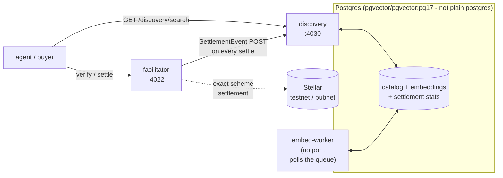

# Operator guide

Everything needed to run the stack: what each process is, every environment variable
it reads, how migrations apply, and what's genuinely configurable today vs. what's
aspirational. Written against the actual code (`config/env.ts` for the facilitator,
`index.ts`/`app.ts`/`embedding-worker-cli.ts` for discovery), not the plan for it.

## 1. The four processes



Four independent processes, three of them ship in this repo's `Dockerfile` (multi-stage,
one target per process) and are wired together in `docker-compose.yml`:

- **`facilitator`** - `/verify`, `/settle`, `/supported`. Talks to Stellar and to
  discovery's ingest endpoint. Never talks to Postgres directly.
- **`discovery`** - `/discovery/resources`, `/discovery/search`,
  `/internal/settlement-events`, `/federation/*`. Owns the Postgres connection.
- **`embed-worker`** - no HTTP surface at all. Polls `embedding_jobs`, writes to
  `embeddings`. Runs the same schema-bootstrap as `discovery` on startup
  (`Catalog.connect()`), so it's safe to start before or after `discovery`.
- **Postgres** - must be `pgvector/pgvector:pg17`, not plain `postgres:17-alpine`. The
  `embeddings` table's `vector` column needs the extension; a vanilla Postgres image
  fails at the `CREATE EXTENSION vector` step on first connect.

`docker-compose.yml` at the repo root runs all four with one command:
```bash
FACILITATOR_STELLAR_PRIVATE_KEY=S... docker compose up
```

## 2. Environment variables

### 2.1 Facilitator (`packages/facilitator/src/config/env.ts`)

| Variable | Required | Default | What it does |
|---|:-:|---|---|
| `FACILITATOR_STELLAR_PRIVATE_KEY` | ✅ | - | The signing/sponsoring key. Process throws on startup if unset. |
| `STELLAR_NETWORK` | | `stellar:testnet` | Must be a CAIP-2 id (`stellar:testnet` \| `stellar:pubnet`); throws if malformed. |
| `STELLAR_RPC_URL` | | `https://soroban-testnet.stellar.org` | |
| `PORT` | | `4022` | |
| `FACILITATOR_STELLAR_FEE_BUMP_SECRET` + `FACILITATOR_STELLAR_CHANNEL_SECRETS` | | unset | Set **both** together to enable channel-account mode (parallel settlements, no sequence-number collisions). `CHANNEL_SECRETS` is comma-separated. Unset = single-signer mode. |
| `MAX_TRANSACTION_FEE_STROOPS` | | `200000` | The library's own default (50,000) is below real Soroban resource fees in practice - this is deliberately explicit, not left at the library value. |
| `DISCOVERY_INGEST_URL` | | `''` (disabled) | Where `SettlementEvent`s POST after a successful settle. Empty = cataloging silently doesn't happen; settlement is unaffected either way. |
| `FACILITATOR_API_KEY` | | unset (open) | Optional Bearer token for `/verify`, `/settle`, `/supported`. Unset means those endpoints are open - fine for local/private use, not for a public hosted deployment. |
| `CORS_ORIGINS` | | `*` | |
| `TRUST_PROXY` | | `loopback,linklocal,uniquelocal` | Express `trust proxy` setting, comma-separated. |

**Rate limiting, stated accurately**: a flat `express-rate-limit` of 120 requests/minute
per process, applied uniformly to `/verify`, `/settle`, and `/supported`. This is
**not** currently configurable via environment variable, and it is **not**
per-principal or tied to settlement success rate - both were described in an earlier
draft of this package's README as if built; they aren't. If your deployment needs
either, that's real work, not a flag to flip.

### 2.2 Discovery API server (`packages/discovery/src/index.ts`, `app.ts`)

| Variable | Required | Default | What it does |
|---|:-:|---|---|
| `DATABASE_URL` | ✅ | - | Must point at a pgvector-enabled Postgres. Process throws on startup if unset. |
| `PORT` | | `4030` | |
| `INGEST_TOKEN` | | unset (open) | Bearer token for `POST /internal/settlement-events`. Unset means that endpoint accepts any request - fine only if it's not publicly reachable. |
| `LOG_LEVEL` | | `info` | pino log level. |
| `CORS_ORIGINS` | | `*` | |

### 2.3 Embedding worker (`packages/discovery/src/embedding-worker-cli.ts`)

| Variable | Required | Default | What it does |
|---|:-:|---|---|
| `DATABASE_URL` | ✅ | - | Same database as the discovery API server - they share the schema. |
| `EMBED_WORKER_POLL_MS` | | `5000` | How often the worker checks for due jobs when the queue is empty. Only matters when there's nothing to do - a full queue is drained continuously, no polling delay between batches. |
| `EMBEDDING_CACHE_DIR` | | library default (OS cache dir) | Where the downloaded model weights (~90MB, `all-MiniLM-L6-v2`) are cached. `docker-compose.yml` points this at a named volume so a container restart doesn't re-download. |
| `LOG_LEVEL` | | `info` | |

## 3. Migrations: applied automatically, not run by hand

There's no separate migration-runner command. `Catalog.connect()` - called by every
process on startup (`discovery`, `embed-worker`, and any test suite) - runs the full
`SCHEMA` constant (`catalog.ts`), which is entirely `CREATE TABLE IF NOT EXISTS` /
`CREATE EXTENSION IF NOT EXISTS` / idempotent `ALTER TABLE ... ADD COLUMN IF NOT
EXISTS` statements. A fresh database and an already-migrated one both just connect
and end up correct - there's no "did I run the migration yet" state to track.

The files in `packages/discovery/migrations/*.sql` are the human-readable, versioned
*record* of each schema change (what changed and why), not scripts you execute
directly - the actual application of each one is embedded in `catalog.ts`'s `SCHEMA`
string. If you're auditing what changed and when, read the migration files in order;
if you're deploying, you don't need to touch them.

## 4. What self-hosting actually looks like today

```bash
git clone <repo> && cd rialto
FACILITATOR_STELLAR_PRIVATE_KEY=S... docker compose up
```

First run: pulls `pgvector/pgvector:pg17`, builds the three app images (glibc-based
`node:22-slim`, not alpine - the embedding worker's native ONNX runtime bindings need
glibc), and the embed-worker downloads the model on its first job. Subsequent starts
reuse the `catalog-data` and `embedding-model-cache` named volumes - no re-download,
no re-migration.

**Self-facilitation** (a resource server running the facilitator logic in-process,
rather than calling a separately-hosted one) is described as a goal in
`docs/architecture.md` but has no working example in this repo yet - `examples/` is
still a placeholder. Don't assume this path is exercised or tested; it isn't.

## 5. Monitoring and health

Both `facilitator` and `discovery` expose `GET /health`. Neither returns anything
beyond `{"status":"ok"}` (discovery's also includes a live resource count) - there's no
readiness-vs-liveness distinction, no dependency health rollup (a facilitator whose
Stellar RPC is down still reports healthy), and no metrics endpoint. A real
production deployment needs more than what ships today; treat `/health` as "the
process is up and its own DB connection didn't throw at startup," not as a full health
check.
