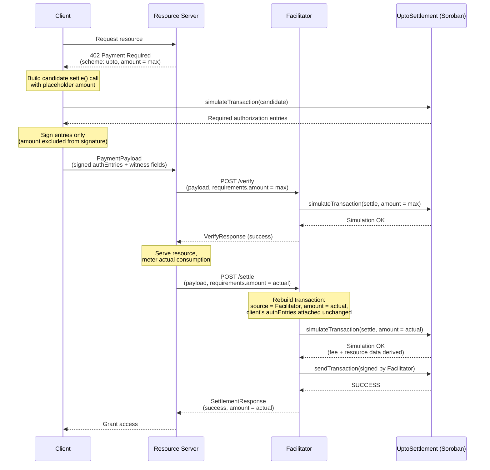

# Scheme: `upto` on `Stellar`

## Versions supported

- ❌ `v1` - we don't plan to support v1 for now.
- ✅ `v2`

## Supported Networks

This spec uses [CAIP-2](https://namespaces.chainagnostic.org/stellar/caip2) identifiers:

- `stellar:pubnet`  Stellar mainnet
- `stellar:testnet`  Stellar testnet

## Summary

`upto` on Stellar authorizes a transfer of **up to a maximum amount** of a
[SEP-41](https://stellar.org/protocol/sep-41) token. The client signs an
authorization for a ceiling; the actual amount charged is determined later,
after a resource has been served, based on real consumption (tokens
generated, bytes transferred, compute used).

> **Note**
> **Scope:** This spec covers [SEP-41](https://stellar.org/protocol/sep-41)-compliant
> Soroban tokens only. Classic Stellar assets are not supported.

Settlement is handled by a single, minimal, **stateless** contract
(`UptoSettlement`), deployed once per network. It holds no funds at any
point  there is no escrow or deposit step  and stores no per-request
state on-chain. Every authorization is fully self-contained in one signed
authorization entry, and is settled in exactly one transaction containing
exactly one operation.

## Example Use Cases

- Paying for LLM token generation (charge per token generated)
- Bandwidth or data transfer metering (charge per byte transferred in a single request)
- Dynamic compute pricing (charge based on actual resources consumed)

## Why `UptoSettlement` exists, and why it needs no storage

The core difficulty `upto` has to solve: the client must sign *something*
before the amount to be charged is known, and that signature must still
bind everything else that matters  recipient, asset, ceiling, timing 
tightly enough that nothing else about the payment can be tampered with
afterward.

Soroban's authorization model checks a signed invocation's arguments
*exactly* against what's submitted on-chain. A contract call signed with a
fixed `amount` therefore can't later be settled for a different amount 
the signature simply wouldn't match. So a plain, direct token transfer
can't be pre-signed for `upto`; `amount` has to be excluded from what's
signed, and Soroban's `require_auth_for_args` makes that possible: it lets
a contract author authorize against a **custom argument tuple** chosen by
the contract, rather than the literal argument list of the function that
was actually invoked. `UptoSettlement.settle` uses this to authorize
against `(payTo, asset, maxAmount, validAfter, deadline, salt, autoRevoke)`
 everything except `amount`.

That still leaves a mechanical problem: once `amount` is free to vary,
nothing has actually authorized a token to move at all  SEP-41 token
transfers themselves still require a matching signed invocation with fixed
arguments, same as any other Soroban call. `UptoSettlement` resolves this
using the standard SEP-41 allowance pattern (`approve` / `transfer_from`):

1. The client signs an authorization entry whose root is the `settle` call
   above, with `token.approve(from, UptoSettlement, maxAmount,
   expirationLedger)` as a **fixed-argument** sub-invocation  this is
   still fine to pre-sign, because the *ceiling*, unlike the eventual
   charge, is known up front.
2. Inside `settle()`, the contract grants itself that allowance (satisfied
   by the pre-signed sub-invocation), then calls
   `transfer_from(self, from, payTo, amount)`. This leg requires no
   separate signature at all, because the contract itself is both the
   invoker and the `spender`  a contract authorizing its own call is
   satisfied automatically.
3. If the client opts in (`autoRevoke = true`), a second pre-signed,
   fixed-argument sub-invocation  `token.approve(from, UptoSettlement, 0,
   0)`  lets the contract zero out any unused allowance in the same
   atomic call, when `amount < maxAmount`.

Because steps 1–3 all happen inside one transaction, there's no interval
during which an approved-but-unspent allowance sits on-chain outside the
settlement itself  nothing to race, front-run, or need separate cleanup
for later.

This also removes the need for the contract to track any state of its own.
Replay protection doesn't come from a stored nonce or request record 
it comes entirely from Soroban's own protocol-level behavior: every signed
authorization entry carries its own nonce, assigned at signing time, and
is consumed on first successful use. `UptoSettlement` doesn't need to
duplicate that bookkeeping; it just relies on the platform already doing
it.

One deliberate scope limitation follows from this: because Stellar permits
exactly one `invokeHostFunction` operation per transaction, each signed
authorization can only ever be consumed by exactly one `settle` call.
Metering many small draws against a single ceiling across multiple
transactions is out of scope for this scheme  each authorization is a
single-shot, single-transaction settlement.

## `PaymentRequirements` for `upto`

```json
{
  "scheme": "upto",
  "network": "stellar:testnet",
  "amount": "10000000",
  "asset": "CBIELTK6YBZJU5UP2WWQEUCYKLPU6AUNZ2BQ4WWFEIE3USCIHMXQDAMA",
  "payTo": "GBHEGW3KWOY2OFH767EDALFGCUTBOEVBDQMCKU4APMDLQNBW5QV3W3KO",
  "maxTimeoutSeconds": 60,
  "extra": {
    "areFeesSponsored": true,
    "settlementContract": "CABCDEF...UPTOSETTLEMENT"
  }
}
```

`amount` is **phase-dependent**: it's the maximum authorized at
verification time, and the actual charge at settlement time. Both phases
use the same `PaymentRequirements` shape; only the value of `amount`
differs between them. See § Phase-Dependent `amount` Semantics for the
full rationale.

**`extra` field definitions:**

- `areFeesSponsored`: whether the facilitator covers the network fee for
  settlement. Currently always `true`  the client never needs an XLM
  balance to complete payment.
- `settlementContract`: the canonical `UptoSettlement` contract address for
  this network  one deployment per network, known in advance by the
  facilitator (hardcoded or config-driven), not something the facilitator
  looks up from this field. It's included here so the facilitator can
  *validate* the resource server's requirements against the address it
  already trusts (§ Facilitator Verification Rules, rule 2), catching a
  misconfigured or malicious resource server pointing settlement at the
  wrong contract. If it doesn't match, the facilitator MUST reject before
  verification proceeds any further.

## Phase-Dependent `amount` Semantics in `PaymentRequirements`

The `/verify` and `/settle` calls to the facilitator share the same
`PaymentPayload` and `PaymentRequirements` types  there is no separate
settlement-specific message type. In `upto`, the `amount` field of
`PaymentRequirements` carries different meaning depending on which call
it's part of:

- At verification time, `amount` represents the **maximum** the client has
  authorized.
- At settlement time, `amount` represents the **actual** amount to settle,
  which MUST be `<= ` the previously authorized maximum.

The resource server communicates the final charge to the facilitator purely
by setting `amount` to the real, metered value in the settlement-time
`PaymentRequirements` it sends to `/settle`  determined from actual
resource consumption (tokens generated, bytes transferred, compute used),
with no additional fields or separate settlement type needed to convey it.

**Rationale**: as per [scheme_upto](https://github.com/x402-foundation/x402/blob/main/specs/schemes/upto/scheme_upto.md#5-phase-dependent-amount-semantics-in-paymentrequirements) reusing `PaymentRequirements` unchanged for both phases keeps
the protocol simple and avoids introducing a settlement-specific message
shape. `amount` naturally maps to "how much" in both contexts  how much is
authorized at verification time, how much to charge at settlement time  so
the same field carries the right meaning in each phase without needing to be
renamed or duplicated.

## Protocol Flow

1. **Client** makes a request to a **Resource Server**.
2. **Resource Server** responds with a `402 Payment Required` status and a
   `PaymentRequired` header whose `accepts[]` entry has `scheme: "upto"` and
   `amount` set to the **maximum** the client may be charged.
3. **Client** builds a candidate invocation of
   `UptoSettlement.settle(from, payTo, asset, maxAmount, validAfter, deadline, salt, autoRevoke, amount)`
    `amount` here is a placeholder (e.g. `0`) used only to shape the
   simulation locally; it plays no role in what gets signed.
4. **Client** simulates this candidate call to identify the required
   authorization entries: the root invocation over
   `(payTo, asset, maxAmount, validAfter, deadline, salt, autoRevoke)`, with
   `token.approve(from, UptoSettlement, maxAmount, expirationLedger)` as a
   sub-invocation, and  only if `autoRevoke = true` 
   `token.approve(from, UptoSettlement, 0, 0)` as a second sub-invocation.
   `expirationLedger` is computed as
   `currentLedger + ceil(maxTimeoutSeconds / estimatedLedgerSeconds)`
   (fallback `estimatedLedgerSeconds = 5`), with margin  see § Time
   Semantics.
5. **Client** signs **only these authorization entries**  there is no
   meaningful "full transaction" to sign at this point, since `amount`
   isn't known yet.
6. **Client** encodes the signed authorization entries (base64 XDR) along
   with the plaintext witness fields and sends them to the resource server
   as the `PaymentPayload`.
7. **Resource Server** forwards `PaymentPayload` and `PaymentRequirements`
   (with `amount` still set to the authorized maximum) to the
   **Facilitator's** `/verify` endpoint.
8. **Facilitator** reconstructs a candidate `settle` invocation using
   `amount = requirements.amount` (the maximum, at this phase), attaches the
   client's signed authorization entries, and validates structure, auth
   entry shape, expiration, and the bound fields (§ Facilitator Verification
   Rules).
9. **Facilitator** simulates this candidate call at the worst case
   (`amount = maxAmount`) to confirm it would succeed, and returns a
   `VerifyResponse`.
10. **Resource Server**, upon successful verification, serves the resource
    and determines the actual amount to charge based on consumption.
11. **Resource Server** forwards the payload to the Facilitator's `/settle`
    endpoint with `requirements.amount` now set to the **actual** charge.
    - NOTE: `/settle` MUST perform full verification independently and MUST
      NOT assume prior verification.
12. **Facilitator** rebuilds the transaction with `amount = requirements.amount`,
    its own account as source, and the client's previously signed
    authorization entries attached unchanged.
13. **Facilitator** re-simulates the rebuilt transaction to verify it
    succeeds, confirms the expected transfer event, and derives the
    settlement fee and fresh Soroban resource data from that simulation.
14. **Facilitator** signs the rebuilt transaction with its own key and
    submits it via RPC `sendTransaction`, then polls for confirmation.
15. **Resource Server** grants the **Client** access upon successful
    settlement.



## `PaymentPayload` `payload` Field

The payload carries **signed authorization entries**, not a full signed
transaction  there is no complete transaction to sign until `amount` is
filled in at settlement time.

```json
{
  "from": "GBHEGW3KWOY2OFH767EDALFGCUTBOEVBDQMCKU4APMDLQNBW5QV3W3KO",
  "payTo": "GBHEGW3KWOY2OFH767EDALFGCUTBOEVBDQMCKU4APMDLQNBW5QV3W3KO",
  "asset": "CBIELTK6YBZJU5UP2WWQEUCYKLPU6AUNZ2BQ4WWFEIE3USCIHMXQDAMA",
  "maxAmount": "10000000",
  "validAfter": 1755000000,
  "deadline": 1755000600,
  "salt": "9f3a45bb4d6d275472c3213d4932...",
  "autoRevoke": true,
  "authEntries": [
    "AAAAAgAAAABriIN4poutFUmHfB6FbFJu8...",
    "AAAAAgAAAACriIN4poutFUmHfB6FbFJu8..."
  ]
}
```

- `authEntries`: base64-encoded XDR of the signed `SorobanAuthorizationEntry`
  objects  the root entry over `(payTo, asset, maxAmount, validAfter,
  deadline, salt, autoRevoke)`, plus its `approve(maxAmount)` sub-invocation
  and, if `autoRevoke`, the `approve(0)` sub-invocation. All three are
  captured within a single root `SorobanAuthorizationEntry`'s invocation
  tree, so in practice this is a one-element array; it's modeled as an array
  for forward compatibility.
- `salt`: a client-chosen, application-layer discriminator  **not** a
  cryptographic requirement. Soroban assigns each signed authorization entry
  its own nonce at signing time, independent of its arguments, so two
  authorizations remain independently replay-safe even if every other field
  is identical. `salt` exists for a narrower, operational reason: two
  concurrent authorizations to the same resource server can easily end up
  with an identical `(payTo, asset, maxAmount, validAfter, deadline,
  autoRevoke)` tuple  e.g. two requests landing on the same price tier and
  the same deadline rounding  which would otherwise be indistinguishable to
  any tooling that keys off those fields (request logs, idempotency checks,
  correlating a payload back to the resource server's own request ID).
  `salt` makes the tuple unique regardless, without contributing to replay
  protection itself.

## `UptoSettlement` Contract Interface

```rust
pub fn settle(
    env: Env,
    from: Address,
    pay_to: Address,
    asset: Address,
    max_amount: i128,
    valid_after: u64,
    deadline: u64,
    salt: BytesN<32>,
    auto_revoke: bool,
    amount: i128,
) -> i128 {
    // 1. Verify authorization  every field except `amount` is bound
    from.require_auth_for_args(
        &env,
        (pay_to.clone(), asset.clone(), max_amount, valid_after, deadline,
         salt.clone(), auto_revoke).into_val(&env),
    );

    // 2. Verify validity window
    let now = env.ledger().timestamp();
    if now < valid_after { panic!("not_yet_valid"); }
    if now >= deadline { panic!("expired"); }

    // 3. Verify payment parameters
    if amount <= 0 || amount > max_amount { panic!("invalid_amount"); }

    let token = token::Client::new(&env, &asset);
    let this = env.current_contract_address();
    let expiration_ledger = ledger_seq_for(&env, deadline);

    // 4. Grant this contract temporary approval up to max_amount 
    //    satisfied by the client's pre-signed, fixed-arg sub-invocation
    token.approve(&from, &this, &max_amount, &expiration_ledger);

    // 5. Execute the transfer  contract is spender & invoker, so this leg
    //    needs no separate signature
    token.transfer_from(&this, &from, &pay_to, &amount);

    // 6. Optional cleanup  only if the client opted in and the transfer
    //    didn't already drain the allowance to zero on its own
    if auto_revoke && amount < max_amount {
        token.approve(&from, &this, &0, &0);
    }

    amount
}
```

`ledger_seq_for(deadline)` converts the wire-format Unix-second `deadline`
into an estimated ledger sequence for the token-level `expiration_ledger`
argument  see § Time Semantics for why this can't be a direct equality and
must be padded.

## Facilitator Verification Rules (MUST)

A facilitator verifying an `upto` payload on Stellar MUST enforce all of the
following before sponsoring and signing the transaction  at both `/verify`
and `/settle`, each independently. `/settle` MUST NOT skip these checks on
the assumption that `/verify` already ran.

### 1. Protocol Validation

- `x402Version` MUST be `2`.
- Both `payload.accepted.scheme` and `requirements.scheme` MUST be `"upto"`.
- `payload.accepted.network` MUST match `requirements.network`.

### 2. Witness Field Consistency

- `payload.payTo` MUST equal `requirements.payTo` exactly.
- `payload.asset` MUST equal `requirements.asset` exactly.
- `payload.maxAmount` MUST equal the **verification-phase** `requirements.amount`
  (the authorized maximum)  **not** the settlement-time amount.
- `extra.settlementContract` MUST match the canonical contract address for
  `requirements.network`.

### 3. Authorization Entry Structure

- The authorization entry's root invocation MUST target
  `UptoSettlement.settle` on the canonical `settlementContract`, with args
  exactly `(payTo, asset, maxAmount, validAfter, deadline, salt, autoRevoke)`
   `amount` MUST NOT appear in the signed argument tuple.
- The root invocation's `subInvocations` MUST contain **exactly**:
  `token.approve(from, settlementContract, maxAmount, expirationLedger)`,
  and, if and only if `payload.autoRevoke = true`, `token.approve(from,
  settlementContract, 0, 0)`. No other sub-invocations are permitted.
- Credential type MUST be `sorobanCredentialsAddress` only.
- The auth entry expiration ledger MUST NOT exceed
  `currentLedger + ceil(maxTimeoutSeconds / estimatedLedgerSeconds)`.

### 4. Maximum Amount Enforcement (settlement time)

- At settle time, `requirements.amount` (the actual charge) MUST be `<=
  payload.maxAmount`. This is enforced independently by the contract itself
  (`settle` panics on violation)  the facilitator MUST still check it
  before submitting, to avoid paying a fee for a transaction it can predict
  will fail.
- `requirements.amount` MAY be `0`.

### 5. 🚨 Facilitator Safety

- The transaction source account the facilitator builds MUST be the
  facilitator's own address, never the client's.
- The facilitator MUST NOT be the `from` address.
- The facilitator address does not appear anywhere in the signed
  authorization  this scheme is deliberately facilitator-agnostic, so
  **any** party holding the signed entries may submit settlement.
  Deployments that need settlement restricted to one specific facilitator
  MUST enforce that off-chain (e.g. the resource server only forwards
  payloads to a trusted facilitator's endpoint).
- The simulation MUST emit events showing only the expected balance changes
  (recipient increase, payer decrease) and no others.

### 6. Simulation

- The facilitator MUST re-simulate against current ledger state at both
  `/verify` (worst-case `amount = maxAmount`) and `/settle`
  (`amount = requirements.amount`).
- The simulation MUST succeed without errors and MUST confirm the exact
  balance change specified by the phase-appropriate `amount`.

## Transaction Fees

- The facilitator MUST derive the settlement fee from a fresh simulation at
  settle time: `simulationResourceFee + inclusionBuffer` (buffer `>= 100`
  stroops).
- The facilitator MUST refresh Soroban resource data (footprint,
  `resourceFee` cap) from that same simulation.
- Since the client never builds a full transaction, there is no client-set
  fee bid to override  the facilitator determines the entire fee itself
  from simulation.
- A `maxTransactionFeeStroops` safety ceiling applies (default 50,000
  stroops, operator-overridable). Exceeding it MUST cause the facilitator to
  reject with `invalid_upto_stellar_payload_fee_exceeds_maximum`.

## Settlement Logic

### Phase 1: Transaction Reconstruction

1. Parse the client's signed authorization entries.
2. Build a fresh `invokeHostFunction` operation calling
   `UptoSettlement.settle(from, payTo, asset, maxAmount, validAfter,
   deadline, salt, autoRevoke, amount)`, with `amount = requirements.amount`
   (the phase-appropriate value  max at verify, actual at settle) and the
   client's signed authorization entries attached.
3. Re-simulate and derive the settlement fee and fresh Soroban resource data
   from the result.
4. Assemble the transaction with:
   - **Source Account**: Facilitator's Stellar address (spends its own
     sequence number, pays fees).
   - **Operation**: The single `invokeHostFunction` call above.
   - **Auth Entries**: The client's signed entries, unmodified.
   - **Fee / Soroban Data**: As derived in step 3.

### Phase 2: Transaction Submission

1. Sign with the facilitator's key.
2. Submit via RPC `sendTransaction`.
3. Confirm `PENDING`, then poll for `SUCCESS` / `FAILED`.

### Phase 3: `SettlementResponse`

```json
{
  "success": true,
  "transaction": "a1b2c3d4e5f6...",
  "network": "stellar:testnet",
  "payer": "GBHEGW3KWOY2OFH767EDALFGCUTBOEVBDQMCKU4APMDLQNBW5QV3W3KO",
  "amount": "3400000"
}
```

- `success`: whether settlement succeeded.
- `errorReason`: omitted on success; present and machine-readable on failure.
- `transaction`: the confirmed settlement transaction hash.
- `network`: CAIP-2 network identifier.
- `payer`: the `from` address.
- `amount`: actual base units charged, echoing the settlement-phase
  `requirements.amount`. MAY be `"0"`.

## Time Semantics: Timestamp vs. Ledger Sequence

Stellar has two independent expiration systems in play here, and this
scheme touches both:

- `validAfter` / `deadline` (wire fields, Unix seconds) are the
  contract-enforced authority, checked via `env.ledger().timestamp()`.
- The signed authorization entries' own expiration, and the
  `expirationLedger` argument passed to both `approve` calls, are ledger
  sequence numbers  there is no exact protocol-guaranteed seconds-per-ledger
  conversion (~5s average, not a guarantee).

Implementations MUST treat `deadline` as authoritative and compute
`expirationLedger` with generous padding beyond it:
`currentLedger + ceil(maxTimeoutSeconds / estimatedLedgerSeconds) + margin`
(fallback `estimatedLedgerSeconds = 5`). Underestimating risks the allowance
or the auth entry itself expiring before `deadline` is reached  which would
silently block a settlement that the contract's own `deadline` check would
otherwise have accepted.

## Error Codes

- `invalid_upto_stellar_settlement_not_yet_valid`: `env.ledger().timestamp() < validAfter`  settlement attempted before the authorization's validity window opens.
- `invalid_upto_stellar_settlement_expired`: `env.ledger().timestamp() >= deadline`  settlement attempted after the authorization's validity window has closed. Note this can also surface indirectly as a simulation failure if the *auth entry's own* ledger-sequence expiration (§ Time Semantics) lapses first  implementations SHOULD distinguish the two where possible, since one indicates the wire-level `deadline` was reached and the other indicates the padding computed for `expirationLedger` was insufficient.
- `invalid_upto_stellar_settlement_exceeds_amount`: attempted settlement
  amount exceeds `maxAmount`.
- `invalid_upto_stellar_payload_fee_exceeds_maximum`: settlement fee derived
  from simulation exceeds `maxTransactionFeeStroops`.
- `UPTO_ALLOWANCE_REQUIRED` (with `412`): the reconstructed transaction fails
  simulation at verify time (e.g. insufficient balance, missing trustline
  for a classic asset wrapped by a Stellar Asset Contract).

## Security Considerations

1. **No overcharge**: `amount > maxAmount` is rejected both by the
   contract's own check and, redundantly, by the SEP-41 allowance the
   contract granted itself moments earlier in the same transaction.
2. **No redirection**: `payTo` is part of the signed root invocation;
   nothing in `settle()` can alter it after the fact.
3. **No allowance-window exposure**: because `approve` and `transfer_from`
   happen inside the same atomic transaction, there is no interval during
   which an approved-but-unspent allowance exists on-chain outside the
   settlement itself.
4. **Facilitator-agnostic by design**: no facilitator identity is bound into
   the signature; any holder of the signed authorization entries can submit
   settlement. This trades a security property (binding settlement to one
   named party) for simplicity and statelessness  deployments that need
   the former must enforce it off-chain (trusted-facilitator allowlisting
   at the resource-server layer).
5. **`maxAmount` in the witness is informational relative to the true
   ceiling**: the *approved* allowance, not the signed `maxAmount` value
   alone, is what ultimately gates `transfer_from`. In practice they're
   equal because `settle()` always approves exactly `maxAmount` itself  but
   implementers should understand that the enforcement mechanism is the
   allowance the contract grants, not merely a stored/compared number.
6. **Stateless replay protection**: replay prevention comes entirely from
   Soroban's protocol-level, per-address authorization-entry nonce
   consumption, not from any `UptoSettlement`-tracked record, since none
   exists.
7. **Server/metering trust**: the client trusts the resource
   server/facilitator to meter honestly up to the authorized ceiling.
   Nothing in this scheme removes that assumption  it governs how much the
   client is willing to authorize, not whether the metering itself is
   truthful.
8. **Out of scope**: multi-settlement/streaming against one authorization is
   not supported and is not structurally possible here  Stellar permits
   exactly one `invokeHostFunction` operation per transaction, so each
   authorization can only ever be consumed by exactly one `settle` call.

## Appendix

### Authorization Pattern

The client signs **authorization entries only**, never a full transaction.
This is required, not optional, for this scheme: a full transaction would
need `amount` fixed at build time, which defeats the entire point of
`upto`. The client:

- Spends no sequence number of its own.
- Requires no XLM balance (fees are fully sponsored by the facilitator).
- Signs a bounded, well-defined argument tuple rather than an entire
  transaction envelope, which keeps the signed payload small and its scope
  easy to audit.

### Example Authorization Entry Tree

```
SorobanAuthorizationEntry
└── rootInvocation: ContractFn
    contract: UptoSettlement
    function: "settle"
    args: [from, payTo, asset, maxAmount, validAfter, deadline, salt, autoRevoke]
    subInvocations:
      ├── ContractFn
      │   contract: <asset token address>
      │   function: "approve"
      │   args: [from, spender=UptoSettlement, amount=maxAmount, expirationLedger]
      │
      └── ContractFn                          # present only if autoRevoke = true
          contract: <asset token address>
          function: "approve"
          args: [from, spender=UptoSettlement, amount=0, expiration_ledger=0]
```

Note `amount` never appears anywhere in this tree  it is supplied only at
submission time, by whichever party ultimately calls `settle`.


