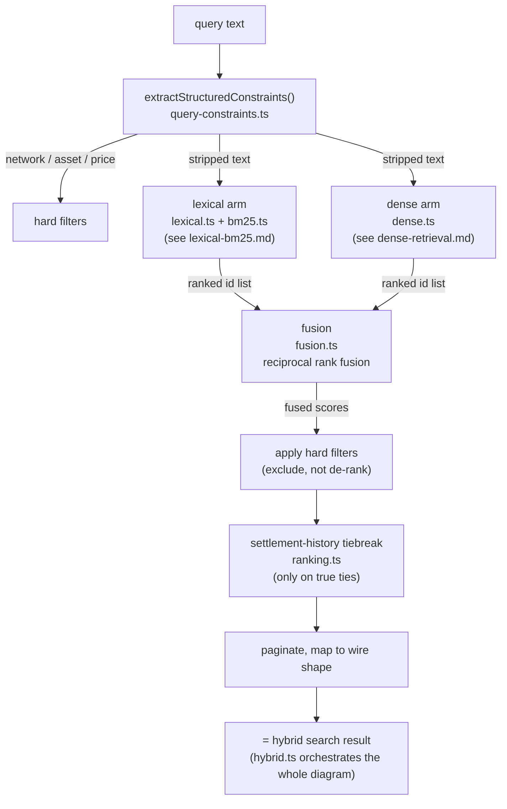

# Fusion, structured constraints, and settlement-history ranking

Source: `packages/discovery/src/search/fusion.ts`, `ranking.ts`,
`query-constraints.ts`, `hybrid.ts`. Tests: `test/unit/12.fusion.spec.ts`,
`13.settlement-ranking.spec.ts`.

## 1. Four words that mean four different things

These get used loosely in conversation; in the code they're four distinct, separately
testable pieces:



- **Lexical** = one arm. Keyword matching only, via Postgres FTS + BM25F. Can be called
  on its own (`catalog.search()` - the "BM25-only" configuration in the eval harness).
- **Dense** = the other arm. Embedding/cosine-similarity matching only, no keywords at
  all. Also callable on its own (`catalog.denseOnlySearch()` - "dense-only").
- **Fusion** = the specific algorithm (§2) that merges the two arms' *rankings* into
  one order. Not a mode you choose - a step inside hybrid search, always run when both
  arms are being used together.
- **Hybrid** = the whole pipeline in the diagram above, start to finish. This is what
  `GET /discovery/search` actually calls (`catalog.hybridSearch()`), and the only one
  of the four that produces `partialResults` (§4) - because it's the only one that
  knows whether *both* arms actually contributed.

The practical consequence: when the dense arm is down, hybrid doesn't fail - fusion
just runs over `[lexicalIds, []]`, which is mathematically equivalent to lexical's own
order (§2 explains why an empty ranker contributes nothing, not a penalty). What looked
like "the whole search is broken" in an earlier debugging session was actually "lexical
alone, with an empty second input" - a distinction that only makes sense once these four
words are kept separate.

## 2. Reciprocal Rank Fusion (RRF)

The two arms produce fundamentally different numbers: a BM25 score (unbounded,
depends on IDF and term frequency, no fixed scale) and a cosine similarity (bounded
`[-1, 1]`, a completely different unit). There's no principled way to add or compare
them directly - "0.6 similarity vs. 4.2 BM25 score, which wins?" has no real answer.
RRF sidesteps the problem entirely by throwing away the raw scores and using only
**rank position**:

```
fusedScore(id) = Σ_ranker  1 / (k + rank_in_that_ranker)
```

`reciprocalRankFusion`'s actual signature is `(rankedLists: number[][]) => Map<number,
number>` - arrays of ids already in rank order, nothing else. There is nowhere in that
signature to pass a score even if you wanted to; this is enforced by the type, not
just by convention (`12.fusion.spec.ts` asserts the function takes exactly one
parameter).

### Worked example

Two rankers, `k = 60` (`RRF_K`, the literature default - see §2.1):

| id | lexical rank | dense rank | fused score |
|---|---:|---:|---|
| A | 1 | 3 | `1/(60+1) + 1/(60+3) = 0.01639 + 0.01587 = 0.03226` |
| B | 2 | 1 | `1/(60+2) + 1/(60+1) = 0.01613 + 0.01639 = 0.03252` |
| C | 3 | absent | `1/(60+3) + 0 = 0.01587` |

B ends up fused-first despite never being lexical's top pick, because it's strong in
*both* arms (rank 2 and rank 1) rather than excellent in just one. C, missing from the
dense arm entirely, still gets a real (if smaller) fused score from lexical alone - an
absent ranker contributes **nothing**, not a penalty. That's the exact property that
lets fusion degrade to "lexical alone" when dense is unavailable (§1) instead of
actively suppressing every result dense didn't also find.

### 2.1 Why `k = 60`

`k` controls how much rank position 1 is favored over position 5. A smaller `k` makes
the gap between top ranks larger (compare `1/(1+1)=0.5` vs `1/(1+5)≈0.167` at `k=1`
against `1/(60+1)≈0.0164` vs `1/(60+5)≈0.0154` at `k=60` - the second pair is far
closer together). `60` is Cormack, Clarke & Buettcher's standard literature default,
not tuned against this catalog. This is a live, open question in
[`benchmarks.md`](../benchmarks.md): at only 18 resources, a smaller `k` (weighting
top ranks more aggressively) might behave better than the literature default tuned for
web-scale corpora - exactly the kind of thing the eval harness exists to eventually
settle with real numbers instead of intuition.

## 3. Structured constraints: hard filters, not ranking boosts

A network, asset, or price mentioned in the query text is extracted
(`extractStructuredConstraints`, `query-constraints.ts`) and applied as an actual SQL
`WHERE`/filter condition - **excluding** non-matching rows outright, not just ranking
them lower. The reasoning: a semantic embedding model has no mechanism to "understand"
that `stellar:testnet` must match *exactly* - cosine similarity would happily consider
`stellar:testnet` and `stellar:pubnet` almost identical strings, which is exactly wrong
for a hard constraint. Recognized tokens are also stripped out of the text handed to
both the lexical and dense arms, so `"weather forecast on stellar:testnet"` searches
for `"weather forecast"` and separately filters to testnet, rather than asking either
arm to somehow rank "stellar:testnet" as a topic.

- **Network** - exact match against the two real CAIP-2 ids this catalog uses
  (`/\bstellar:(testnet|pubnet)\b/i`). Real, tested: `12.fusion.spec.ts` seeds two
  otherwise-identical listings differing only in network and confirms the wrong one is
  **absent** from results entirely, not merely ranked lower.
- **Asset** - a small known vocabulary (`XLM`, `USDC`, `native`), matched case-
  insensitively. A lighter-weight v1, honestly scoped as such.
- **Price** - a simple `under/below/less than/cheaper than $N` pattern, compared
  against the raw stored `amount` value. Documented limitation: this is not
  currency- or unit-normalized (stroops vs. whole-token amounts aren't reconciled),
  so it's a best-effort filter, not a precise one.

The filter is applied **after** fusion, against the merged candidate set - so a
resource that only the dense arm found, on the wrong network, is excluded exactly the
same as one only lexical found. Network is additionally applied as a real SQL `WHERE`
clause on the lexical arm's own candidate query (`rankLexicalCandidates`'s `network`
option), so both layers agree independently rather than relying on the post-fusion
filter alone to catch everything.

## 4. Settlement-history ranking: a tiebreak, not a signal

```
orderByFusedScoreThenSettlementHistory(fusedScores, resources):
  sort by fusedScore DESC
    then by settlement_count DESC   (only when fusedScore is EXACTLY equal)
      then by last_updated DESC     (only when settlement_count is also equal)
```

The word "tiebreak" is precise here, not loose: this only ever activates when two
resources have the **exact same** fused RRF score - which, given RRF's rank-position
arithmetic, is rarer than it might sound (it requires the two resources to occupy
complementary rank positions across the two arms that happen to sum identically, not
just "both seem relevant"). A genuinely higher fused score always wins regardless of
settlement history, by construction - `13.settlement-ranking.spec.ts` proves this
directly with a fixture where the *lower*-fused-score resource has a dramatically
stronger settlement history (500 settlements vs. 1) and still loses, because fusion
already resolved that comparison on real relevance signal.

What it *does* do: among resources fusion genuinely can't distinguish, prefer the one
with more successful settlements, and within an equal settlement count, the more
recently active one. This is the mechanism that lets a proven, frequently-paid
endpoint edge out an equally-relevant but never-used listing - real signal, sourced
from `resources.settlement_count` ([atomically incremented on every
settlement](../architecture.md), not read-modify-write), applied only where it can't
override anything more informative.

## 5. `partialResults`: three honest conditions

```
partialResults = denseErrored OR embeddingBacklogExists OR denseResults.length === 0
```

Each condition catches a different failure shape:

- **`denseErrored`** - the dense arm threw (model unreachable, embed call failed).
  Caught in `hybrid.ts`, never propagates to a 500 - the request still returns
  lexical-only results.
- **`embeddingBacklogExists`** - `embedding_jobs` has any row still `pending` or
  `processing`. Even if dense search itself ran fine, the worker hasn't caught up on
  every resource yet, so the answer is provably incomplete, not just "dense said
  nothing this time."
- **`denseResults.length === 0`** - dense ran without error and found genuinely
  nothing (e.g. a fresh generation with no vectors at all yet).

`partialResults: false` only when none of the three are true - the whole pipeline ran,
found something in both arms, and the worker has no backlog. This is checked live in
`12.fusion.spec.ts`: seeding a resource and deliberately *not* running the worker
yields `partialResults: true`; running the worker to clear the backlog before
searching flips it to `false`.
