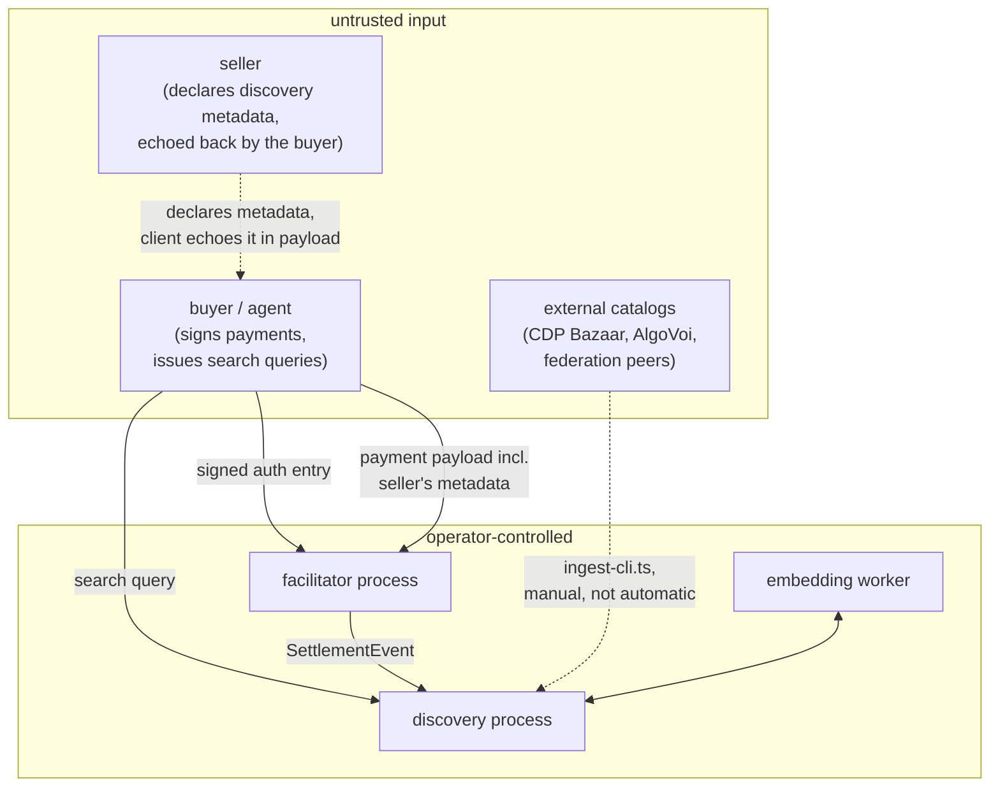

# Threat model

RFP audit-readiness deliverable, covering the facilitator's trust boundary, the
catalog's trust boundary, and the discovery search surface. Written against the code
as it exists, including one finding discovered and fixed during this document's own
research (§4.1) - included specifically to show the process, not smoothed over.

## 1. Assets

What an attacker might actually want, in rough order of severity:

1. **Buyer funds** - the payment authorized by a signed auth entry.
2. **Sponsor funds** - the facilitator operator's XLM, spent covering fees for
   `areFeesSponsored: true` settlements.
3. **Catalog integrity** - what `/discovery/search` returns; a forged or hijacked
   listing redirects an agent's payment to the wrong recipient or the wrong service.
4. **Availability** - both services' uptime; a facilitator that's down blocks every
   payment behind it, not just its own traffic.
5. **Operational secrets** - `FACILITATOR_STELLAR_PRIVATE_KEY`, `INGEST_TOKEN`,
   `FACILITATOR_API_KEY`.
6. **Internal implementation detail** - stack traces, file paths, library versions;
   low severity alone, but reconnaissance value for an attacker building toward
   something else (§4.1 is exactly this case).

## 2. Actors and trust levels



The load-bearing fact this diagram exists to make visible: **a seller's discovery
metadata is not trusted directly**. It's declared by the seller, but *echoed into the
payment payload by the buyer's client* before the facilitator ever sees it - meaning a
hostile buyer client (not just a hostile seller) can attempt to substitute forged
metadata for whatever the seller actually declared. This is exactly why the integrity
gauntlet (§3) exists on the discovery side, independent of anything the facilitator or
seller do correctly.

## 3. Catalog poisoning - the discovery trust boundary

**Threat**: a hostile client crafts payment payload metadata to poison the catalog -
forged service name, a `routeTemplate` designed to traverse outside the declared
resource, oversized fields designed to degrade storage or search quality, or a
structurally invalid envelope designed to probe for a crash.

**Mitigation**: the integrity gauntlet (`packages/discovery/src/validation.ts`,
`cleanEntry()`), applied to **every** submission regardless of provenance
(`observed-settlement`, `registered`, or `ingested` - a federation-ingested entry gets
the identical treatment a live settlement does):

- `routeTemplate` is **percent-decoded before** traversal/scheme checks, not after -
  the specific ordering bug class where `%2e%2e%2f` sails past a naive check that
  only looks for literal `../` in the still-encoded string. Verified with a dedicated
  test fixture distinct from the plain-traversal case
  (`test/unit/01.gauntlet.spec.ts`).
- Field-level **soft-drop**: an oversized `serviceName`, an invalid tag, a
  loopback/IP-literal `iconUrl` each drop *only that field* - the rest of the entry
  still catalogs. Verified with a combination fixture (multiple defects in one
  submission) asserting the `dropped: [...]` list names exactly the defective fields
  and nothing else.
- **Envelope-level hard-reject**: a structurally invalid submission (missing
  `accepts`, wrong `type`) is rejected outright with a named reason
  (`accepts_missing`, `type_invalid`, ...), not soft-dropped and not a generic
  exception.
- Outcomes reported via the response body (`dropped`, `cataloged`) on every ingest
  call, so a seller/facilitator operator can tell whether a listing landed and why not.

**Residual risk, stated honestly**: `iconUrl` validation blocks loopback/IP-literal
hosts but does not resolve DNS at validation time - a hostname that currently resolves
to a public IP but is later repointed to an internal address (DNS rebinding) is not
caught by a one-time string check. Low practical severity here (the field is stored
and returned to clients, never fetched server-side), but worth naming rather than
implying the check is stronger than it is.

## 4. Discovery API - input handling

### 4.1 Finding, reproduced and fixed: jsonpath construction leaked a stack trace

**Found during this document's own research**, not from an external report. The
`extensions` filter on `GET /discovery/resources` built a Postgres jsonpath string by
manually stripping `"` characters from user input (`catalog.ts`'s `filterClauses`):

```ts
// before
params.push(`$.** ? (@ == "${ext.replace(/"/g, '')}")`);
```

This handles embedded quotes but not backslashes. A value ending in `\` (e.g.
`GET /discovery/resources?extensions=foo%5C`) produces `$.** ? (@ == "foo\")` -
inside a JSON-style string literal, `\"` is an *escaped quote*, not a closing quote,
so the string literal runs unterminated. Postgres's jsonpath parser throws a real
parse error, and `packages/discovery/src/app.ts` had **no error-handling
middleware** at all (unlike the facilitator's, which does) - so the rejection fell
through to Express's own default handler, which renders an HTML page containing the
error's **stack trace**: absolute server file paths, the exact dependency
(`pg-pool/index.js`), and internal file/line references
(`catalog.ts:273:22`, `router.ts:89:30`).

Reproduced live before the fix:
```
$ curl -G "http://localhost:4031/discovery/resources" --data-urlencode 'extensions=foo\'
HTTP 500
<pre>error: unterminated quoted string at end of jsonpath input
    at .../pg-pool/index.js:45:11
    at async Catalog.list (.../catalog.ts:273:22)
    at async <anonymous> (.../router.ts:89:30)</pre>
```

**Fixed, two independent layers** (defense in depth - either alone would have closed
this specific case, both together close this case and others):

1. `JSON.stringify(ext)` replaces the hand-rolled quote-stripping - jsonpath string
   literals share JSON's escaping rules, so this correctly escapes backslashes,
   quotes, and control characters regardless of input, closing the specific
   vulnerability at its source.
2. `app.ts` now has the same coded-JSON error-handling middleware the facilitator
   already had - so any *other* unhandled error (one this review didn't specifically
   find) also returns `{"error":{"code":"simulation_failed","reason":"..."}}` instead
   of an HTML stack trace, closing the general class of bug, not just this instance.

Regression-tested (`test/unit/15.error-handling.spec.ts`): four adversarial
`extensions` values (trailing backslash, embedded quote+backslash, repeated
backslashes, a jsonpath-operator-shaped string) all return clean `200`s; a genuinely
unhandled error (the pool closed out from under a live request) returns the coded
JSON shape, not HTML.

### 4.2 SQL injection review

Every other dynamic `WHERE` clause across `catalog.ts`, `lexical.ts`, and `dense.ts`
was reviewed for the same class of issue. All of them build parameter *placeholder
numbers* into the SQL text (`` `$${params.length}` ``) while the actual **values**
travel through `pg`'s parameterized query array - the standard safe pattern, since
the value never becomes part of the SQL string itself. This holds for every filter
(`type`, `payTo`, `scheme`, `network`), the lexical candidate-selection query
(including the AND→OR fallback added this session), and the dense-search cosine
query. The `extensions` case in §4.1 was the one place a user value was embedded into
a *sub-language string* (jsonpath) rather than passed as a plain SQL parameter, which
is why it needed its own escaping discipline separate from `pg`'s parameterization -
worth remembering as a category if a similar sub-language (e.g. a future full-text
query syntax) gets exposed to user input later.

### 4.3 Rate limiting - a real, currently open gap

**Facilitator**: a flat 120 req/min limiter on `/verify`, `/settle`, `/supported`
(§4.4 has more on why this matters for sponsor economics specifically).

**Discovery**: **no rate limiting at all** on `GET /discovery/resources` or
`GET /discovery/search`. Both are public, unauthenticated-by-default endpoints. A
resource-exhaustion attack against `/discovery/search` is more expensive to the
operator than a typical read-only API abuse case, because a query with no lexical
candidates falls through to the dense arm, which runs a real embedding-model
inference call per request (§4.4 of `docs/search/dense-retrieval.md`) - meaningfully
more CPU per request than a database read. This is an open gap, not a mitigated one;
flagged here rather than implied to be handled.

### 4.4 Sponsor economics abuse

**Threat**: a caller burns the operator's sponsored fees by submitting payments
designed to fail after the facilitator has already paid simulation/submission cost -
`/verify` triggers real Soroban RPC simulation, `/settle` submits and sponsors a real
transaction fee, and a caller who never intends to complete a legitimate payment can
still cost the operator money per request.

**Mitigation, as it exists today**: the same flat 120 req/min limiter as §4.3,
optionally paired with `FACILITATOR_API_KEY` gating (§ operator guide). **Not**
implemented, despite being described in an earlier draft of the facilitator's README
as if it were: per-principal cost accounting, or rate limits tied to a caller's
settlement *success rate* specifically (as opposed to raw request volume). A caller
with a valid API key (or no key at all, if the operator left it unset) can currently
submit failing settlements at the same rate as succeeding ones without the system
distinguishing between them. This is the most consequential open gap in this document
- it's the one with a direct path to operator financial loss, not just information
disclosure or availability.

## 5. Settlement path - signature and replay

**Threat**: tampering with a payment's amount, asset, or recipient; replaying a
previously-settled authorization; front-running a settlement.

**Mitigation**: delegated entirely to `@x402/stellar` and Soroban's own authorization
model, not reimplemented in this codebase (`packages/facilitator/src/schemes/exact.ts`
composes the upstream package rather than handling raw signatures itself). The signed
auth entry binds the exact recipient, asset, and amount; any tampering is a signature
verification failure enforced by Stellar consensus, not application logic here.
Replay protection rides Soroban's native auth-entry nonce, same delegation.

**Not independently verified this session**: custom `__check_auth` smart-account
support, and the precise behavior under Soroban resource-limit exhaustion, both
depend entirely on `@x402/stellar`'s internals and were not audited as part of this
document - stated as an open item rather than assumed safe.

## 6. Federation and external ingestion

**Threat**: a malicious federation peer or external catalog source (`ingest-cli.ts`'s
CDP/AlgoVoi mappers) injects poisoned entries via a path that bypasses the integrity
gauntlet.

**Mitigation**: ingestion runs the identical `cleanEntry()` gauntlet as a live
settlement (§3) - there is no separate, weaker validation path for
`provenance: 'ingested'` entries. `POST /federation/register` only stores a peer's
declared `name`/`baseUrl`/`catalogUrl` in the database; it does not automatically
fetch or ingest from a registered peer's `catalogUrl` - actual ingestion is a manual
CLI invocation (`pnpm ingest cdp <dir>` / `pnpm ingest algovoi [url]`), not a scheduled
or automatic job triggered by registration. This means registering a malicious
`catalogUrl` alone has no effect until an operator manually chooses to ingest from it
- a meaningful containment boundary, though also a manual step that could be
automated later without re-reading this section first.

## 7. Secrets and operational hygiene

`FACILITATOR_STELLAR_PRIVATE_KEY`, `INGEST_TOKEN`, `FACILITATOR_API_KEY` are read from
plain environment variables - no KMS/HSM/secrets-manager integration in this codebase.
This is a standard, expected gap for a v1 self-hostable service (the operator's
deployment environment is responsible for how the env vars themselves are protected),
named here so it isn't silently assumed handled.

The embedding model (`all-MiniLM-L6-v2`) downloads from the Hugging Face hub at first
use - a supply-chain trust dependency on that hub and the specific model repository.
Low practical risk for an embedding model specifically (weights don't execute code),
but a real dependency worth naming: a compromised model repo or an unpinned revision
could serve different weights than expected. `embedding-model.ts` pins a `revision`
(`'main'` - itself not a specific commit/tag, worth tightening to a pinned revision in
a future pass).

## 8. What this document does not cover

The `upto` scheme's Soroban contract has no implementation yet (spec only, see
`docs/specs/scheme_upto_stellar.md`) - nothing to threat-model until it exists. The
MCP server and seller SDK are README-only stubs, same reasoning. This document will
need a real revision once either lands, not just an addendum.
